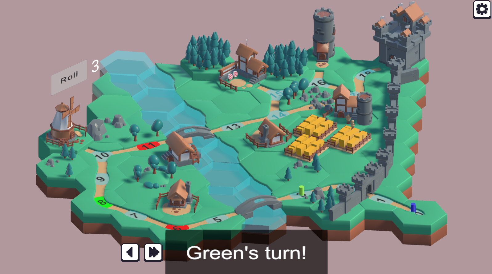

# Expedition

<h1 align="center">Demonstration</h1>
<h3 align="center">This is the updation part of the project.</h3>

    <h3>First Look</h3>    
     
    
  
    	
        
    

    <h3>Updated Game Play</h3>    
     
    

        
Simple Rule: 
               
            - Whenever player stepped on RED node, player will move 3 steps backward 
              
            - Otherwise, when player stepped on BLUE node, player will be granted another turn.
             
            - Winning Condition: Who enter the castle first is the winner.
        

    

     
    
  
    	
    

    <h3>Updated End Game Condition + UI</h3>
     
    
        
        
    

